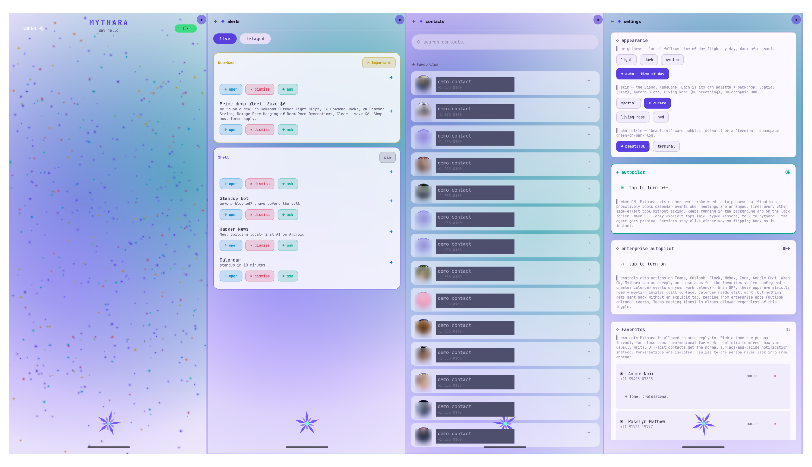
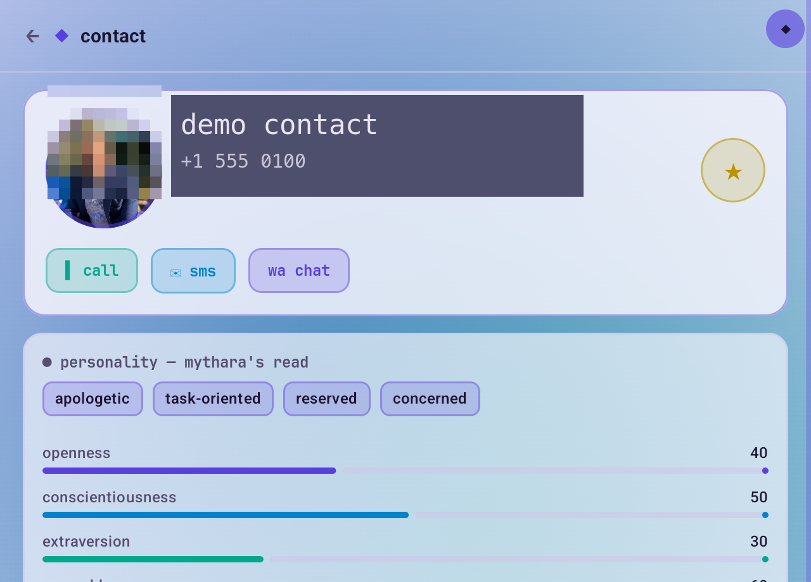

# Mythara

> An open-source, local-first, fully-private **agentic AI mobile OS layer** for Android — an alternative to Google's "Android is now an intelligence system" pitch and the always-on cloud-Gemini posture of Android 17.

<p align="center">
  
</p>

<p align="center">
  <em>Home (face mesh + spinning rose) · Alerts (live notification triage) · People (contacts merged with on-device personality analysis) · Appearance (multi-skin theme engine)</em>
</p>

---

## What Mythara is

Mythara is a phone OS layer **you sideload as one app**, written in Kotlin + Jetpack Compose, that runs an **agentic AI** entirely under your control:

- **Local-first.** Your contacts, messages, photos, locations, personality analysis, voice samples, face samples — everything Mythara learns lives on the device. Nothing is sent to a Big Tech intelligence system unless you explicitly enable a remote model for the chat surface.
- **Agentic runtime.** A built-in agent loop (`agent/AgentLoop.kt`) with 65+ tools — calls, SMS, WhatsApp, calendar, alarms, tasks, screen reading via accessibility, shell + Termux, file I/O, web fetch, image generation, on-device face recognition, contact analytics, notification triage, planner. It can perceive, decide, and act on your phone the way Gemini wants to — except the brain is yours and the data stays here.
- **Private by construction.** No analytics SDKs, no telemetry, no remote logging. Personality analysis happens on-device via a lexical + LLM cascade. Face embeddings + voice samples never leave the phone unless you opt-in to sync them via your own GitHub repo.
- **Bring your own model.** First-class support for MiniMax M2.x as a cheap, capable backbone today; clean abstractions so you can swap to a local Gemma / Llama / Qwen / DeepSeek runtime tomorrow. The agent loop is model-agnostic.

> Built by [@ankurCES](https://github.com/ankurCES) (Ankur Nair) — engineered using **Lumi**, the multi-agent platform Ankur built at [CES](https://www.ces.tech). Mythara is the field-deployed test bed for what a personal AI looks like when you own the stack end-to-end.

---

## Why this exists

At the 2025 Android Show, Google rebranded Android **from an operating system to an "intelligence system"** — meaning Gemini is now embedded across the OS surface from messaging to camera to navigation to in-car. Android 17 ships with custom widgets you can generate from a text prompt, a magic-pointer Gemini summon on Google Books, Rambler-style voice editing, and an auto-form-fill feature that will scan your photo library for your passport and your kids' passports without a second thought.

The features are impressive. The data pipeline is **theirs**.

[The Android Show comment section was turned off](https://www.youtube.com/watch?v=DYFoun7w0VA) — which says enough about how the company expects users to feel about every personal-AI demo being a privacy + targeted-ad funnel.

**Mythara is what the same vision looks like when the data, the agent, and the model stay on your phone.** Same demo as the Google keynote — "snap a concert poster → book floor tickets → add it to my calendar" — wired through a local agent loop with tools you can audit, a vocabulary you can wipe, a personality the model learned about *you* that you can read and edit on screen.

This repo is an invitation to build that future. **Fork it. Strip MiniMax. Drop in Gemma. Build a private Pixel.** Make a phone whose AI is yours, not Google's.

---

## Features

### Agentic runtime — the heart of the app
- **AgentLoop** (`agent/AgentLoop.kt`) — streaming MiniMax / local-model interface, tool-call iteration, **context-budget guard** with auto-summarisation, **loop-detection guardrail**, **hook middleware** for path sanitising + dangerous-shell blocking, **plan-executor** for multi-step tasks, **skill suggestion store** that learns repeated tool sequences and offers to save them.
- **65+ tools** wired through one `ToolRegistry` — SMS / WhatsApp / phone-call / calendar / alarm / tasks / triage / face recognition / notification capture / app launch / clipboard / location / sensors / file I/O / Termux exec / web fetch / image generation / Canvas render / and many more. Add new ones in ~30 LOC.
- **Skill recording** — Mythara watches your repeated tool chains and offers to save them as named skills with parameter placeholders. Re-fire a 4-step morning routine by saying "do my morning".
- **Confirmation gate** — destructive tools always prompt; user can persist allowlists.
- **Plan / decompose** — long prompts go through a planner agent that produces a structured multi-step plan; `PlanExecutor` walks it step-by-step with per-step success criteria.

### Local-first memory + personality
- **On-device personality model** — every contact builds a Big-Five profile + notable-traits chips + relationship summary + how-to-message-them prose, all generated from your real chat history with that person via a lexical-then-LLM cascade. None of it ever leaves the device unless you opt in.
- **Face recognition** — MobileFaceNet running on NNAPI / GPU. You curate sample photos per contact; Mythara recognises them in future photos. Embeddings stay local.
- **Memory graph** — typed entities (person / place / organisation / app / notification-source) with classifier-driven cleanup that demotes spam / notification senders out of the People list.
- **Optional cross-device sync** via a GitHub repo *you own* — analytics jsonl shards push and pull through your private repo; nothing touches a vendor cloud.

### Privacy + control
- **Biometric lock** on the agent surface; lock-screen island stays available without exposing chat.
- **Notification listener** — surfaces live notifications into an Alerts hub with tap-to-open-source-app, "ask Mythara to handle this", and triage-history training.
- **Termux + shell tools** for power users; allowlisted binaries, hooks that block `rm -rf` / `dd` / `chmod 777`.
- **Shizuku integration** for cosmetic Android settings (font scale, dark mode, accent colour, animation scale) without root.
- **Camera wakes on phone-pickup only** — uses `TYPE_SIGNIFICANT_MOTION` so the front sensor is dark unless you physically pick up the phone.

### Design language
- **Multi-skin theme engine** — Spatial (flat, default), Aurora Glass (translucent + blur), Living Rose (HR-breathing geometric rose petals), Holographic HUD (line-art + concentric rings). Light + dark + auto (time-of-day) variants.
- **Terminal mode** — opt-in monospace green-on-dark chat for users who want the old-school feel.
- **Brand surface** — animated face mesh that tracks your head pose via ML Kit, a spinning rose amulet PTT button at the bottom, vertical breathing spine on the right edge for app launching + status.

### Mobile-first agentic UX
- **Press-and-hold-rose-to-talk** anywhere in the app (3 s threshold) → voice transcript → agent submit.
- **Notification tap → Alerts hub** (one-tap triage) or → source app (BAL-exempted `PendingIntent.send`).
- **Wake word** "Hey Mythara" via Vosk grammar with phonetic variants.
- **Pickup-only camera** — `TYPE_SIGNIFICANT_MOTION` + 8-second window, extended on each face detection. Camera path drain drops ~10× vs always-on.

---

## What it looks like

| Surface | What it does |
|---|---|
| **Home** | Camera-tracked particle face mesh + bottom rose-amulet PTT. Tap rose = Chat. Hold rose ≥ 3 s = push-to-talk. Notifications appear as a top strip. |
| **Alerts** | Live grouped-by-app notification feed. Tap row → source app. "Ask Mythara" → forwards into the agent loop with "help me handle this". |
| **People** | Full address book merged with Mythara's interaction history. Tap → contact detail with Big Five bars, notable traits, personality insights ("how to message them"), relationship summary, face samples panel, photos-of grid, recent interactions. All locally derived. |
| **Appearance** | Skin picker (Spatial / Aurora / Rose / HUD) + brightness mode + chat-bubble vs terminal toggle + autopilot toggle for agent always-on. |

<p align="center">
  
  <br />
  <em>Contact detail (top section, redacted) — personality card leads with traits + Big Five bars derived locally from your real interaction history.</em>
</p>

---

## Architecture (one minute)

```
┌──────────────────────────────────────────────────────────────────┐
│                        ChatViewModel                             │
│        (composer · tool-call rendering · plan cards)             │
└────────────────────┬─────────────────────────────────────────────┘
                     │
┌────────────────────▼─────────────────────────────────────────────┐
│                       AgentRunner                                │
│   queue · plan-gate · marker prefix routing · turn lifecycle     │
└────────────────────┬─────────────────────────────────────────────┘
                     │
┌────────────────────▼─────────────────────────────────────────────┐
│                       AgentLoop                                  │
│  ┌────────────┐ ┌────────────┐ ┌────────────┐ ┌──────────────┐   │
│  │ Context    │ │ Loop       │ │ Hook       │ │  Skill       │   │
│  │ Budget     │ │ Detector   │ │ Runner     │ │  Suggester   │   │
│  │ Guard      │ │            │ │            │ │              │   │
│  └────────────┘ └────────────┘ └────────────┘ └──────────────┘   │
└────────────────────┬─────────────────────────────────────────────┘
                     │
┌────────────────────▼─────────────────────────────────────────────┐
│                     ToolRegistry (65+ tools)                     │
│  send_sms · send_whatsapp · place_call · create_calendar_event   │
│  set_alarm · create_task · screen_read · run_shell · termux_exec │
│  read_file · write_file · web_fetch · render_canvas              │
│  generate_image · open_url · save_skill · run_skill · ...        │
└──────────────────────────────────────────────────────────────────┘

   On-device analytics            Memory                 Model
   ─────────────────             ───────              ──────────
   PersonaTraitExtractor         Room DBs              MiniMaxClient
   GraphTurnExtractor            DataStore             (or your local
   ContactProfileRepo            MemorySync             Gemma / Llama /
   FaceTracker                   (your GitHub)          Qwen / DeepSeek)
   NotificationListener
```

Detailed docs: [`docs/SELF_ORGANIZING_LEARNING.md`](docs/SELF_ORGANIZING_LEARNING.md), [`docs/PRIVACY.md`](docs/PRIVACY.md).

---

## Getting started

### Requirements
- Android Studio Iguana+
- JDK 17
- An Android 14+ device (Pixel 9 / 10 / Fold tested)
- MiniMax API key (free tier — used as the default agent backbone) **or** a local Gemma / Llama runtime you wire in

### Build
```bash
git clone https://github.com/ankurCES/project_mythara.git
cd project_mythara
./gradlew :app:assembleDebug
adb install -r app/build/outputs/apk/debug/app-debug.apk
```

### First run
1. Grant `CAMERA`, `RECORD_AUDIO`, `READ_CONTACTS`, `READ_CALL_LOG`, `POST_NOTIFICATIONS`.
2. Open Settings → enter your MiniMax API key (or wire your own model in `minimax/StreamingChat.kt`).
3. Pick a skin. Done.

---

## Contributing — build your own private Pixel

This is a personal-AI Android OS layer that needs people to grow into a movement. **The agentic runtime, the local memory pipeline, and the design language are yours to fork.** Concrete contribution paths:

- **Swap MiniMax for a local model.** `minimax/StreamingChat.kt` is the only file the agent loop talks to. Implement the same interface against `llama.cpp` / `mlc-llm` / Gemma Nano / your favourite open-weights runtime. PR it as a `local-gemma/` or `local-llama/` module. **This is the highest-impact change anyone can make to this repo.**
- **Add tools.** New tools land in `agent/tools/` and register in `ToolRegistry`. Examples: GitHub PR creation, Obsidian vault writes, Spotify control, calendar conflict detection, expense categorisation.
- **Build new skins.** The theme engine takes `MythPalette` + `SkinSpec` (`ui/theme/`). Light variants for existing skins, new aesthetics (CRT, paper, brutalist, etc.) are all welcome.
- **Other model integrations.** Add image-gen behind `GenerateImageTool`. Add speech-to-speech via Whisper-on-device or Vosk. Add a planner LLM separate from the chat model.
- **Translations.** All strings live in `res/values/strings.xml` and `agent/AgentLoop.kt` system prompts.
- **Privacy audits.** Read `MemorySync` and tell us what we missed. Open issues, send PRs.

Code style: existing files document patterns extensively in KDoc. Mirror the tone. Tests + screenshots in PRs are appreciated but not required.

---

## Roadmap

- [ ] **Local-model module** — Gemma Nano via MediaPipe LLM inference; first-class swap from MiniMax. (PRs wanted.)
- [ ] **Onboarding tutorial** — gesture-by-gesture intro for the rose-amulet, spine, PTT, alerts.
- [ ] **Plugin SDK** — third-party tools as Android Services discovered at runtime; Mythara loads them with permission gates.
- [ ] **Watch face + complications** — the rose lives on your Wear OS face and pulses with your HR.
- [ ] **Foldable tabletop layout** — when the Pixel Fold is half-open, Mythara routes face mesh to the top half and chat composer to the bottom.

---

## Related discussion (the Android 17 framing)

The 2025 Android Show pitched Gemini-everywhere as Android's new identity. The presenters openly acknowledged "the data collection conversation" while showing demos that hinged on Gemini scanning your photo library for passport numbers. Comments were turned off. [Watch the recap and the skepticism here](https://www.youtube.com/watch?v=DYFoun7w0VA).

Some of the new Android 17 features Mythara takes a private-local stance against / inverts:

| Android 17 / Aluminium OS feature | Mythara's local-first take |
|---|---|
| Gemini magic-pointer summon on Google Books | Rose-amulet PTT + global long-press anywhere |
| Custom widgets generated from a text prompt | Agent renders to `Canvas` (Tailwind + Preact bundled) on demand |
| Rambler voice-editing | Local STT (Vosk) + edit pass in the agent loop |
| Cross-device file access via Google's pipeline | Optional sync through *your own* GitHub repo |
| AI passport-auto-fill from photos | Local face + entity index; never queried by an ad pipeline |
| In-car Gemini integration | (Out of scope — but plug the agent into Android Auto via an action) |

If you want the Google demo's outcomes without the data trade-off, Mythara is the kit.

---

## License

MIT. See [LICENSE](LICENSE).

## Topics

`agentic-ai` · `local-first` · `private-ai` · `android` · `kotlin` · `jetpack-compose` · `on-device-ai` · `personal-assistant` · `open-source-android` · `gemini-alternative` · `agentic-mobile` · `android-17` · `aluminium-os-alternative` · `personal-pixel` · `local-llm` · `mobile-agent-runtime` · `intelligent-mobile-os` · `privacy-first-ai` · `self-hosted-ai` · `byo-model`

---

<p align="center">
  <strong>Build your phone's AI. Don't rent it.</strong>
</p>
